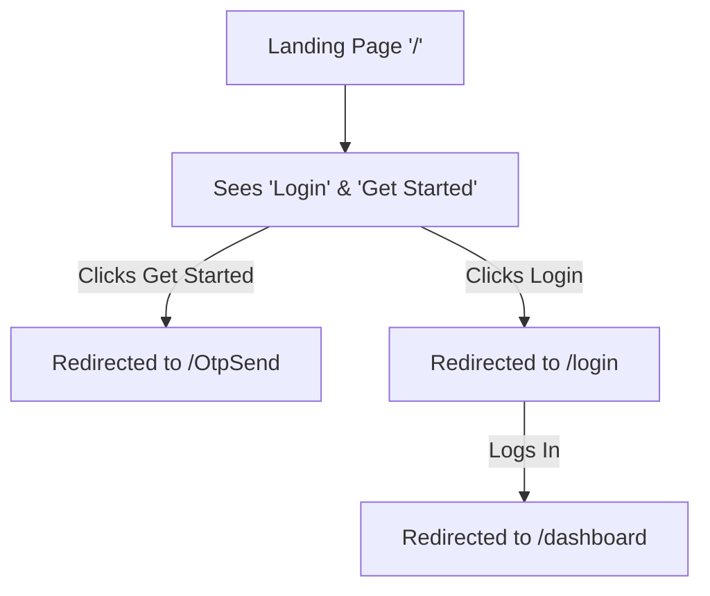

<div align="center">
  <h1>🛡️ Route Protection Implementation</h1>
  <p><i>Comprehensive guide to the authentication and route security mechanisms in the Next.js frontend.</i></p>
</div>

---

## ✅ Full Route Protection Active

### 🔒 Protected Feature Routes (Require Authentication)
All the following routes require valid JWT authentication. Users without tokens are seamlessly redirected to `/login`:

1. **Resume Service Routes**
   - `/UploadResume` 🛡️
   - `/GetResume` 🛡️
   - `/DeleteResume` 🛡️
2. **Job Matching Routes**
   - `/GetResumeData` 🛡️
   - `/AnalysisResume` 🛡️
3. **Interview Service**
   - `/dashboard` 🛡️
   - `/InterviewService` 🛡️
   - `/interviewprep` 🛡️

### 🌍 Public Routes (No Authentication Required)
These routes remain accessible to everyone:
- `/` (Landing Page - *Redirects auth'd users to dashboard*)
- `/login`, `/register`, `/OtpSend`, `/verify-otp`, `/reset-password`
- `/DetailsDocs` (Documentation)

---

## 📡 API Protection & Error Handling

All API calls now include automatic error handling via the `handleApiResponse()` wrapper.

### Authentication Error Handler (`lib/utils/apiErrorHandler.ts`)
- Automatically catches `401 Unauthorized` and `403 Forbidden` errors.
- Clears `localStorage` tokens securely.
- Forces an immediate redirect to `/login` upon auth failure.
- Gracefully handles network timeouts.

---

## ⚙️ Protection Mechanisms

### 1. Client-Side Route Protection (`useAuth`)
The `useAuth()` hook (found in `lib/auth/withProtectedRoute.tsx`) runs on mount:
- Checks `localStorage` for a valid token.
- Displays a neat loading state while verifying credentials.
- Bounces unauthenticated sessions to `/login`.

### 2. API Request Protection
All API requests automatically embed the JWT token via the `Authorization: Bearer <token>` header.

### 3. Next.js Middleware (`middleware.ts`)
Protects all feature routes at the server/edge level, stopping unauthorized access before the page even renders.

### 4. Smart Landing Page Redirect
Authenticated users visiting `/` are instantly pushed to `/dashboard` to avoid flashing the logged-out marketing page.

---

## 🌊 User Experience Flows

### Unauthenticated User Flow



### Authenticated User Flow

```mermaid
flowchart TD
    A[Landing Page '/'] -->|Auto Redirect| B[/dashboard]
    B --> C[Full Access to Features]
    C --> D{API Call}
    D -->|Token Valid| E[Returns Data]
    D -->|Token Expired 401| F[Auto Redirect to /login]
```

---

## 🧪 Testing Checklist

To verify the protection is working seamlessly, confirm that:

- [x] Unauthenticated user cannot access `/dashboard` (redirects to `/login`).
- [x] Unauthenticated user cannot access `/UploadResume` (redirects to `/login`).
- [x] Unauthenticated user can view `/` (landing page).
- [x] Authenticated user sees `/dashboard` upon visiting the landing page.
- [x] Authenticated user can access all feature pages.
- [x] API call with an expired token redirects to `/login`.
- [x] Logout successfully clears the token and redirects to home.

---

<div align="center">
  <b>All Routes Now Secured! 🔒</b>
</div>
